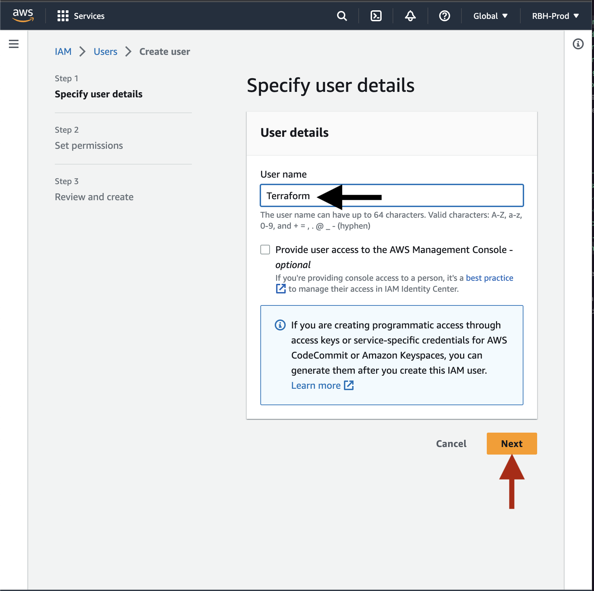

# Deployment Guide

This guide will walk through the setup of deploying the application to AWS using terraform.

## Prerequisites

- A working AWS Root Account
- Terraform installed on your system, recommend using [tfenv](https://github.com/tfutils/tfenv)
- Familiarity with AWS Console

## Stage 1 - Setup AWS Terraform User

1. Login to AWS
   
2. Ensure us-east-1 is selected for the region
   
3. Navigate to IAM and select the IAM service
   
4. Select `Users` from the menu on the left of the IAM dashboard
   
5. Press `Add user` button
   
6. Make the username `Terraform` and click next
   
7. Select `Attach policies directly` and select the `AdministratorAccess` AWS managed policy, then press next
   
8. Confirm the user creation on the next screen
9. Click on the newly created user and navigate to `Security Credentials`, scroll down and click on `Create access key`
   
10. Select `Command Line Interface (CLI)` and accept the above recommendation, then press `Next`
    
11. Press `Create access key`
12. On The next screen, it will provide you the credentials. Store them safely and press `Done`

Your AWS account should now be configured correctly for terraform.

## Stage 2 - Terraform setup

1. On the cloned repository open a terminal
2. navigate to the `terraform` directory
3. Run ` terraform init`
4. Run `aws configure`
5. Enter the access key of your Terraform user created in stage 1
6. Enter the secret key for the terraform user
7. Setup the default region as `us-east-1`
8. Leave the output format as default

### Google Auth Setup

Before continuing with Terraform, you must create google oauth credentials.

1. Navigate to `https://console.cloud.google.com/`
2. Login with the Google account you plan on using to manage the project
3. Create a new project
   
4. Enter a project name and press next
   
5. Once the project is created and is the actively selected project. Navigate to `APIs & Services`
   

6. From the left sidemenu select credentials
   
7. Click `Configure Consent Screen`
8. Select `External` and press create
9. Fill in the information with App name, user email, app logo, and domain
10. Click continue
11. Under scopes, select userinfo.email, userinfo.profile, and openid
12. Press continue and continue
13. Press return to dashboard
14. Return to credentials
15. Click create credentials
16. Select `OAuth Client ID`
17. Select `Web Application`
18. Name it `RBH Web`

19. Add the following javascript origins

- `https://<your-domain-here>`
- `http://localhost:3000` for local development

20. Add the following redirect URIs:

- `https://<your-domain-here>/api/auth/callback/google`
- `http://localhost:3000/api/auth/callback/google` for local development

21. Press create, it will provide you the client id and client secret, store them somewhere safe and feel free to download the JSON file.

### Terraform Continued

9. In the terraform folder in your terminal, run `terraform plan`
10. Enter the google id and secret
11. Verify terraform creates a valid plan
12. run `terraform apply` to provision the infrastructure
13. Type `yes` to approve the creation
14.
